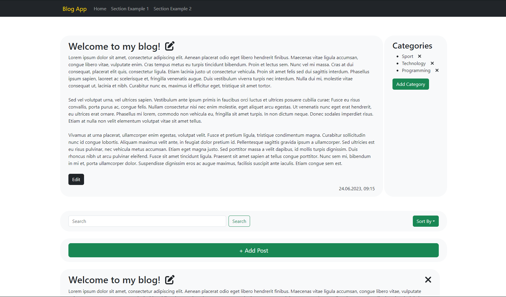

# Blog Application

This is a simple blog application that allows users to create, read, update, and delete blog posts. The application
features a welcoming post, categories, a search function, and the ability to sort posts by date (ascending and
descending) or alphabetically by title. By default, posts are sorted by date, starting from the most recent. Each post
has a title and content, which can be edited. All posts, except the welcoming post, can be deleted. Categories can be
added or removed. New posts can be created. The GUI is fully responsive.

## Technologies Used

- Backend:
    - Java 17
    - Spring Boot 3.1
    - Hibernate
    - H2 database
    - Lombok
    - Gradle

- Frontend:
    - React 18.2
    - React Bootstrap 2.7
    - Axios

## Features

- Create, read, update, and delete blog posts
- Sort posts by date (ascending and descending) or alphabetically by title
- Edit post titles and contents
- Add or remove categories
- Fully responsive GUI

## Getting Started

To get a local copy of the project up and running, follow these steps:

1. Clone the repository: `git clone https://github.com/84311/blog-application.git`
2. Navigate to the backend directory: `cd blog-application\backend\`
3. Install the backend dependencies using Gradle: `gradle build`
4. Start the backend server: `gradle bootRun`
5. Navigate to the frontend directory: `cd ..\frontend\blog-app\`
6. Install the frontend dependencies using npm: `npm install`
7. Start the frontend development server: `npm start`
8. Open your web browser and visit `http://localhost:3000` to access the blog application.

## Sample Data

The application loads sample data from a JSON file on startup. You can modify this data or add your own posts and
categories.

## Additional Information

The application also keeps track of the number of requests made to each endpoint and stores this information in the
database.

## License

This project is licensed under the [MIT License](https://opensource.org/licenses/MIT).

Feel free to contribute, report issues, or submit pull requests.

